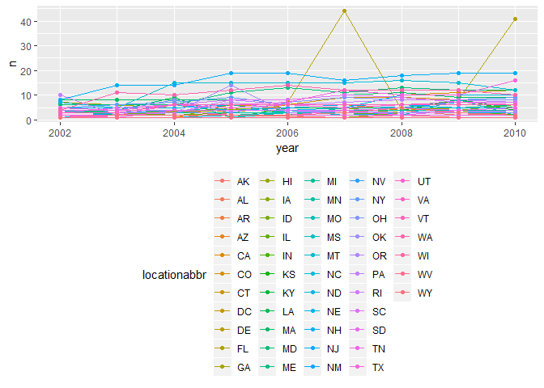
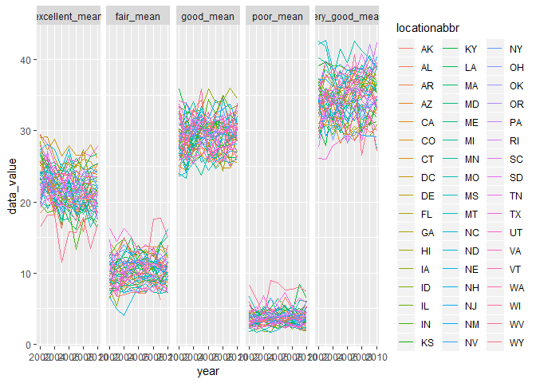
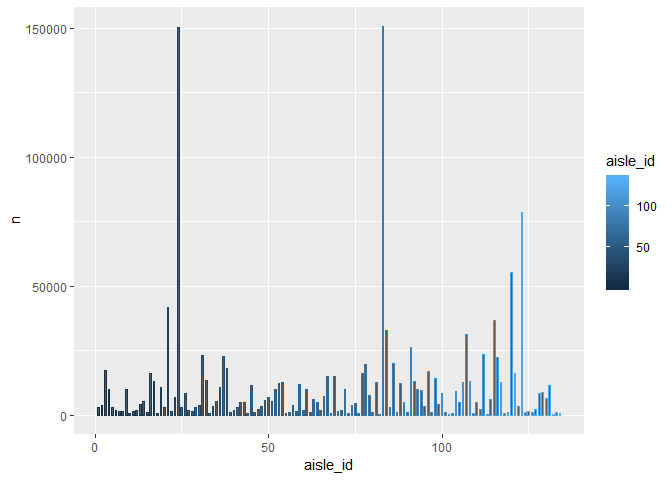

p8105\_hw3\_yz3297
================
Yue Zhao
2018年10月12日

Problem 1
=========

``` r
library(tidyverse)
```

    ## -- Attaching packages ------------------------------------------------------------------------------------------------------------------------------------- tidyverse 1.2.1 --

    ## √ ggplot2 3.0.0     √ purrr   0.2.5
    ## √ tibble  1.4.2     √ dplyr   0.7.6
    ## √ tidyr   0.8.1     √ stringr 1.3.1
    ## √ readr   1.1.1     √ forcats 0.3.0

    ## -- Conflicts ---------------------------------------------------------------------------------------------------------------------------------------- tidyverse_conflicts() --
    ## x dplyr::filter() masks stats::filter()
    ## x dplyr::lag()    masks stats::lag()

``` r
library(p8105.datasets)

data(brfss_smart2010)
head(brfss_smart2010)
```

    ## # A tibble: 6 x 23
    ##    Year Locationabbr Locationdesc Class Topic Question Response Sample_Size
    ##   <int> <chr>        <chr>        <chr> <chr> <chr>    <chr>          <int>
    ## 1  2010 AL           AL - Jeffer~ Heal~ Over~ How is ~ Excelle~          94
    ## 2  2010 AL           AL - Jeffer~ Heal~ Over~ How is ~ Very go~         148
    ## 3  2010 AL           AL - Jeffer~ Heal~ Over~ How is ~ Good             208
    ## 4  2010 AL           AL - Jeffer~ Heal~ Over~ How is ~ Fair             107
    ## 5  2010 AL           AL - Jeffer~ Heal~ Over~ How is ~ Poor              45
    ## 6  2010 AL           AL - Jeffer~ Heal~ Fair~ Health ~ Good or~         450
    ## # ... with 15 more variables: Data_value <dbl>,
    ## #   Confidence_limit_Low <dbl>, Confidence_limit_High <dbl>,
    ## #   Display_order <int>, Data_value_unit <chr>, Data_value_type <chr>,
    ## #   Data_Value_Footnote_Symbol <chr>, Data_Value_Footnote <chr>,
    ## #   DataSource <chr>, ClassId <chr>, TopicId <chr>, LocationID <chr>,
    ## #   QuestionID <chr>, RESPID <chr>, GeoLocation <chr>

``` r
brfssnew_data=brfss_smart2010 %>%
  janitor::clean_names()  %>%
  filter(topic=="Overall Health")   %>%
  select(year,locationabbr, locationdesc, response, data_value)%>%
  spread(key=response, value= data_value) %>%
  #clean the names, filter the overall health topic, drop other variables and turning data from long to wide
  
  janitor::clean_names()
  #clean the names again after spreading

brfssnew_data
```

    ## # A tibble: 2,125 x 8
    ##     year locationabbr locationdesc   excellent  fair  good  poor very_good
    ##    <int> <chr>        <chr>              <dbl> <dbl> <dbl> <dbl>     <dbl>
    ##  1  2002 AK           AK - Anchorag~      27.9   8.6  23.8   5.9      33.7
    ##  2  2002 AL           AL - Jefferso~      18.5  12.1  32.7   5.9      30.9
    ##  3  2002 AR           AR - Pulaski ~      24.1  12.5  29.9   4.2      29.3
    ##  4  2002 AZ           AZ - Maricopa~      21.6  10.3  26.9   4.6      36.6
    ##  5  2002 AZ           AZ - Pima Cou~      26.6   7.5  31.9   3.9      30.1
    ##  6  2002 CA           CA - Los Ange~      22.7  14.3  28.7   4.5      29.8
    ##  7  2002 CO           CO - Adams Co~      21.2  14.4  29     4.2      31.2
    ##  8  2002 CO           CO - Arapahoe~      25.5   8    29.3   2.1      35.2
    ##  9  2002 CO           CO - Denver C~      22.2  11.1  36.6   3        27.1
    ## 10  2002 CO           CO - Jefferso~      23.4  11.4  26.3   2.4      36.6
    ## # ... with 2,115 more rows

Answering questions:

``` r
filter(count(filter(brfssnew_data,year==2002),locationabbr), n==7)
```

    ## # A tibble: 3 x 2
    ##   locationabbr     n
    ##   <chr>        <int>
    ## 1 CT               7
    ## 2 FL               7
    ## 3 NC               7

``` r
#select from the freqency table in 2002 to see which states appeared at 7 locations
```

Question 1: In 2002, Connecticut, Florida and North Carolina were observed at 7 locations.

``` r
    brfssnew_data %>%
      group_by(locationabbr,year) %>%
      summarize(n=n()) %>%
      ggplot(aes(x = year, y = n, color = locationabbr)) + 
      geom_point() + geom_line() + 
      theme(legend.position = "bottom")
```



Question 2: Above is the spaghetti plot that shows the number of observations in each state from 2002 to 2010.

``` r
 brfssnew_data %>%
      filter(locationabbr=="NY", year== 2002 | year== 2006 | year==2010) %>%
      group_by(locationabbr,year) %>%
      summarize(mean(excellent),sd(excellent))
```

    ## # A tibble: 3 x 4
    ## # Groups:   locationabbr [?]
    ##   locationabbr  year `mean(excellent)` `sd(excellent)`
    ##   <chr>        <int>             <dbl>           <dbl>
    ## 1 NY            2002              24.0            4.49
    ## 2 NY            2006              22.5            4.00
    ## 3 NY            2010              22.7            3.57

Question 3: This table shows the mean and standard deviation of the proportion of "excellent" in NY for the year 2002,2006,2010.

``` r
    mean_data= brfssnew_data %>%
      group_by(locationabbr,year) %>%
      summarize(excellent_mean=mean(excellent),very_good_mean=mean(very_good),good_mean=mean(good),fair_mean=mean(fair),poor_mean=mean(poor)) %>%
      gather(key=response, value= data_value, excellent_mean: poor_mean) %>%
      na.omit()
      
        
    mean_data %>%
      ggplot(aes(x = year, y =data_value , color=locationabbr))  + 
      geom_line() +
      facet_grid(~response)
```



Question 4: This is the panel showing for each year and state, the mean proportion of each category over time.

Problem 2
---------

``` r
data(instacart)

instacart
```

    ## # A tibble: 1,384,617 x 15
    ##    order_id product_id add_to_cart_ord~ reordered user_id eval_set
    ##       <int>      <int>            <int>     <int>   <int> <chr>   
    ##  1        1      49302                1         1  112108 train   
    ##  2        1      11109                2         1  112108 train   
    ##  3        1      10246                3         0  112108 train   
    ##  4        1      49683                4         0  112108 train   
    ##  5        1      43633                5         1  112108 train   
    ##  6        1      13176                6         0  112108 train   
    ##  7        1      47209                7         0  112108 train   
    ##  8        1      22035                8         1  112108 train   
    ##  9       36      39612                1         0   79431 train   
    ## 10       36      19660                2         1   79431 train   
    ## # ... with 1,384,607 more rows, and 9 more variables: order_number <int>,
    ## #   order_dow <int>, order_hour_of_day <int>,
    ## #   days_since_prior_order <int>, product_name <chr>, aisle_id <int>,
    ## #   department_id <int>, aisle <chr>, department <chr>

The dimension of dataset instacart is 1384617 by 15. The main variables are order\_id, product\_id, user\_id, order\_number, product\_name , aisle\_id, department. Above is the sample observations of the dataset.

Question 1: There are 134 aisles.

``` r
aisle_count=count(instacart,aisle) %>%
arrange(desc(n))
print(aisle_count, n=10)
```

    ## # A tibble: 134 x 2
    ##    aisle                              n
    ##    <chr>                          <int>
    ##  1 fresh vegetables              150609
    ##  2 fresh fruits                  150473
    ##  3 packaged vegetables fruits     78493
    ##  4 yogurt                         55240
    ##  5 packaged cheese                41699
    ##  6 water seltzer sparkling water  36617
    ##  7 milk                           32644
    ##  8 chips pretzels                 31269
    ##  9 soy lactosefree                26240
    ## 10 bread                          23635
    ## # ... with 124 more rows

``` r
#let's sort it by descending order and print out top ten entries
```

These are the top 10 aisles the most items are ordered from.

Question 2:

``` r
   aisle_count2=count(instacart,aisle_id) %>%
      arrange(desc(n))
    
   aisle_count2 %>%
      ggplot(aes(x = aisle_id, y = n, color=aisle_id)) + 
      geom_bar(stat="identity", width=0.5)
```



To arrange this graph in "aisle name" seems impossible because the names are too long to show on the screen. Alternatively, we can use the aisle id instead.

Problem 3
---------
