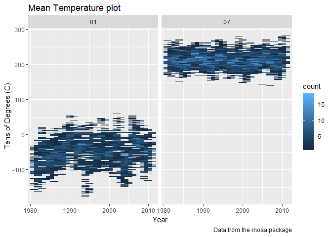
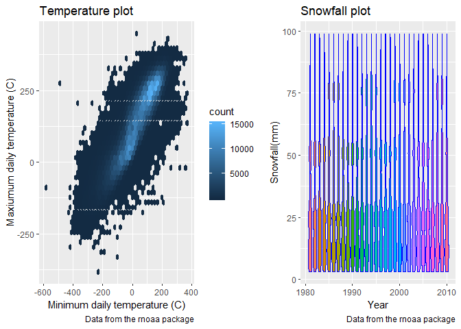

p8105\_hw3\_yz3297
================
Yue Zhao
2018年10月12日

Problem 1
=========

``` r
library(tidyverse)
```

    ## -- Attaching packages ------------------------------------------------------------------------------------------------------------------------------------- tidyverse 1.2.1 --

    ## √ ggplot2 3.0.0     √ purrr   0.2.5
    ## √ tibble  1.4.2     √ dplyr   0.7.6
    ## √ tidyr   0.8.1     √ stringr 1.3.1
    ## √ readr   1.1.1     √ forcats 0.3.0

    ## -- Conflicts ---------------------------------------------------------------------------------------------------------------------------------------- tidyverse_conflicts() --
    ## x dplyr::filter() masks stats::filter()
    ## x dplyr::lag()    masks stats::lag()

``` r
library(p8105.datasets)

data(brfss_smart2010)
head(brfss_smart2010)
```

    ## # A tibble: 6 x 23
    ##    Year Locationabbr Locationdesc Class Topic Question Response Sample_Size
    ##   <int> <chr>        <chr>        <chr> <chr> <chr>    <chr>          <int>
    ## 1  2010 AL           AL - Jeffer~ Heal~ Over~ How is ~ Excelle~          94
    ## 2  2010 AL           AL - Jeffer~ Heal~ Over~ How is ~ Very go~         148
    ## 3  2010 AL           AL - Jeffer~ Heal~ Over~ How is ~ Good             208
    ## 4  2010 AL           AL - Jeffer~ Heal~ Over~ How is ~ Fair             107
    ## 5  2010 AL           AL - Jeffer~ Heal~ Over~ How is ~ Poor              45
    ## 6  2010 AL           AL - Jeffer~ Heal~ Fair~ Health ~ Good or~         450
    ## # ... with 15 more variables: Data_value <dbl>,
    ## #   Confidence_limit_Low <dbl>, Confidence_limit_High <dbl>,
    ## #   Display_order <int>, Data_value_unit <chr>, Data_value_type <chr>,
    ## #   Data_Value_Footnote_Symbol <chr>, Data_Value_Footnote <chr>,
    ## #   DataSource <chr>, ClassId <chr>, TopicId <chr>, LocationID <chr>,
    ## #   QuestionID <chr>, RESPID <chr>, GeoLocation <chr>

``` r
brfssnew_data=brfss_smart2010 %>%
  janitor::clean_names()  %>%
  filter(topic=="Overall Health")   %>%
  select(year,locationabbr, locationdesc, response, data_value)%>%
  spread(key=response, value= data_value) %>%
  #clean the names, filter the overall health topic, drop other variables and turning data from long to wide
  
  janitor::clean_names()
  #clean the names again after spreading

brfssnew_data
```

    ## # A tibble: 2,125 x 8
    ##     year locationabbr locationdesc   excellent  fair  good  poor very_good
    ##    <int> <chr>        <chr>              <dbl> <dbl> <dbl> <dbl>     <dbl>
    ##  1  2002 AK           AK - Anchorag~      27.9   8.6  23.8   5.9      33.7
    ##  2  2002 AL           AL - Jefferso~      18.5  12.1  32.7   5.9      30.9
    ##  3  2002 AR           AR - Pulaski ~      24.1  12.5  29.9   4.2      29.3
    ##  4  2002 AZ           AZ - Maricopa~      21.6  10.3  26.9   4.6      36.6
    ##  5  2002 AZ           AZ - Pima Cou~      26.6   7.5  31.9   3.9      30.1
    ##  6  2002 CA           CA - Los Ange~      22.7  14.3  28.7   4.5      29.8
    ##  7  2002 CO           CO - Adams Co~      21.2  14.4  29     4.2      31.2
    ##  8  2002 CO           CO - Arapahoe~      25.5   8    29.3   2.1      35.2
    ##  9  2002 CO           CO - Denver C~      22.2  11.1  36.6   3        27.1
    ## 10  2002 CO           CO - Jefferso~      23.4  11.4  26.3   2.4      36.6
    ## # ... with 2,115 more rows

Answering questions:

``` r
filter(count(filter(brfssnew_data,year==2002),locationabbr), n==7)
```

    ## # A tibble: 3 x 2
    ##   locationabbr     n
    ##   <chr>        <int>
    ## 1 CT               7
    ## 2 FL               7
    ## 3 NC               7

``` r
#select from the freqency table in 2002 to see which states appeared at 7 locations
```

Question 1: In 2002, Connecticut, Florida and North Carolina were observed at 7 locations.

``` r
    brfssnew_data %>%
      group_by(locationabbr,year) %>%
      summarize(n=n()) %>%
      ggplot(aes(x = year, y = n, color = locationabbr)) + 
      geom_point() + geom_line() + 
      theme(legend.position = "bottom")
```


Question 2: Above is the spaghetti plot that shows the number of observations in each state from 2002 to 2010.

``` r
 brfssnew_data %>%
      filter(locationabbr=="NY", year== 2002 | year== 2006 | year==2010) %>%
      group_by(locationabbr,year) %>%
      summarize(mean(excellent),sd(excellent))
```

    ## # A tibble: 3 x 4
    ## # Groups:   locationabbr [?]
    ##   locationabbr  year `mean(excellent)` `sd(excellent)`
    ##   <chr>        <int>             <dbl>           <dbl>
    ## 1 NY            2002              24.0            4.49
    ## 2 NY            2006              22.5            4.00
    ## 3 NY            2010              22.7            3.57

Question 3: This table shows the mean and standard deviation of the proportion of "excellent" in NY for the year 2002,2006,2010.

``` r
    mean_data= brfssnew_data %>%
      group_by(locationabbr,year) %>%
      summarize(excellent_mean=mean(excellent),very_good_mean=mean(very_good),good_mean=mean(good),fair_mean=mean(fair),poor_mean=mean(poor)) %>%
      gather(key=response, value= data_value, excellent_mean: poor_mean) %>%
      na.omit()
      
        
    mean_data %>%
      ggplot(aes(x = year, y =data_value , color=locationabbr))  + 
      geom_line() +
      facet_grid(~response)
```


Question 4: This is the panel showing for each year and state, the mean proportion of each category over time.

Problem 2
---------

``` r
data(instacart)

instacart
```

    ## # A tibble: 1,384,617 x 15
    ##    order_id product_id add_to_cart_ord~ reordered user_id eval_set
    ##       <int>      <int>            <int>     <int>   <int> <chr>   
    ##  1        1      49302                1         1  112108 train   
    ##  2        1      11109                2         1  112108 train   
    ##  3        1      10246                3         0  112108 train   
    ##  4        1      49683                4         0  112108 train   
    ##  5        1      43633                5         1  112108 train   
    ##  6        1      13176                6         0  112108 train   
    ##  7        1      47209                7         0  112108 train   
    ##  8        1      22035                8         1  112108 train   
    ##  9       36      39612                1         0   79431 train   
    ## 10       36      19660                2         1   79431 train   
    ## # ... with 1,384,607 more rows, and 9 more variables: order_number <int>,
    ## #   order_dow <int>, order_hour_of_day <int>,
    ## #   days_since_prior_order <int>, product_name <chr>, aisle_id <int>,
    ## #   department_id <int>, aisle <chr>, department <chr>

The dimension of dataset instacart is 1384617 by 15. The main variables are order\_id, product\_id, user\_id, order\_number, product\_name , aisle\_id, department. Above is the sample observations of the dataset.

Question 1: There are 134 aisles.

``` r
aisle_count=count(instacart,aisle) %>%
arrange(desc(n))
print(aisle_count, n=10)
```

    ## # A tibble: 134 x 2
    ##    aisle                              n
    ##    <chr>                          <int>
    ##  1 fresh vegetables              150609
    ##  2 fresh fruits                  150473
    ##  3 packaged vegetables fruits     78493
    ##  4 yogurt                         55240
    ##  5 packaged cheese                41699
    ##  6 water seltzer sparkling water  36617
    ##  7 milk                           32644
    ##  8 chips pretzels                 31269
    ##  9 soy lactosefree                26240
    ## 10 bread                          23635
    ## # ... with 124 more rows

``` r
#let's sort it by descending order and print out top ten entries
```

These are the top 10 aisles the most items are ordered from.

Question 2:

``` r
   aisle_count2=count(instacart,aisle_id) %>%
      arrange(desc(n))
    
   aisle_count2 %>%
      ggplot(aes(x = aisle_id, y = n, color=aisle_id)) + 
      geom_bar(stat="identity", width=0.5)
```


To arrange this graph in "aisle name" seems impossible because the names are too long to show on the screen. Alternatively, we can use the aisle id instead.

Question 3:

``` r
    instacart %>%
     filter(aisle=="baking ingredients" | aisle=="dog food care"| aisle=="packaged vegetables fruits") %>%
     group_by(aisle) %>%
     count(product_name) %>%
     filter(n==max(n) & (aisle=="baking ingredients"|aisle=="dog food care"| aisle=="packaged vegetables fruits"))
```

    ## # A tibble: 3 x 3
    ## # Groups:   aisle [3]
    ##   aisle                    product_name                                  n
    ##   <chr>                    <chr>                                     <int>
    ## 1 baking ingredients       Light Brown Sugar                           499
    ## 2 dog food care            Snack Sticks Chicken & Rice Recipe Dog T~    30
    ## 3 packaged vegetables fru~ Organic Baby Spinach                       9784

``` r
     #choose the maximum in each category
```

This table shows the most popular item in each aisle.

Question 4:

``` r
     instacart %>%
       filter(product_name=="Pink Lady Apples" | product_name=="Coffee Ice Cream") %>%
       group_by(product_name,order_dow) %>%
       summarise(mean_1=mean(order_hour_of_day)) %>%
       spread(key=order_dow, value=mean_1) %>%
       rename("Sunday" = "0" ,"Monday" = "1", "Tuesday" = "2", "Wednesday" = "3", "Thursday" = "4", "Friday" = "5", "Saturday" = "6")
```

    ## # A tibble: 2 x 8
    ## # Groups:   product_name [2]
    ##   product_name     Sunday Monday Tuesday Wednesday Thursday Friday Saturday
    ##   <chr>             <dbl>  <dbl>   <dbl>     <dbl>    <dbl>  <dbl>    <dbl>
    ## 1 Coffee Ice Cream   13.8   14.3    15.4      15.3     15.2   12.3     13.8
    ## 2 Pink Lady Apples   13.4   11.4    11.7      14.2     11.6   12.8     11.9

This is a 2\*7 table showing for each day of the week, the mean hour of ordering for each item.

Problem 3
---------

``` r
data(ny_noaa)

ny_noaa
```

    ## # A tibble: 2,595,176 x 7
    ##    id          date        prcp  snow  snwd tmax  tmin 
    ##    <chr>       <date>     <int> <int> <int> <chr> <chr>
    ##  1 US1NYAB0001 2007-11-01    NA    NA    NA <NA>  <NA> 
    ##  2 US1NYAB0001 2007-11-02    NA    NA    NA <NA>  <NA> 
    ##  3 US1NYAB0001 2007-11-03    NA    NA    NA <NA>  <NA> 
    ##  4 US1NYAB0001 2007-11-04    NA    NA    NA <NA>  <NA> 
    ##  5 US1NYAB0001 2007-11-05    NA    NA    NA <NA>  <NA> 
    ##  6 US1NYAB0001 2007-11-06    NA    NA    NA <NA>  <NA> 
    ##  7 US1NYAB0001 2007-11-07    NA    NA    NA <NA>  <NA> 
    ##  8 US1NYAB0001 2007-11-08    NA    NA    NA <NA>  <NA> 
    ##  9 US1NYAB0001 2007-11-09    NA    NA    NA <NA>  <NA> 
    ## 10 US1NYAB0001 2007-11-10    NA    NA    NA <NA>  <NA> 
    ## # ... with 2,595,166 more rows

The dimension of dataset instacart is 2595176 by 7. The main variables are id,date,prcp, snow, snwd, tmax, tmin. Above is the sample observations of the dataset. tmax and tmin are the varibles that have the most missing values. The proportion of missing data in tmax is 43.7102532%. The proportion of missing data in tmin is 43.7126422%.

Question 1:

``` r
ny_noaa2=ny_noaa %>%
separate("date", c("Year", "Month", "Day"), sep = "-") 
```

``` r
count(ny_noaa2, snow)
```

    ## # A tibble: 282 x 2
    ##     snow       n
    ##    <int>   <int>
    ##  1   -13       1
    ##  2     0 2008508
    ##  3     3    8790
    ##  4     5    9748
    ##  5     8    9962
    ##  6    10    5106
    ##  7    13   23095
    ##  8    15    3672
    ##  9    18    3226
    ## 10    20    4797
    ## # ... with 272 more rows

The most observed value for snowfall is 0 (n=2008508), 13 (n=23905) , 25 (n=31022) , NA (n=381221). Because snow do not happen in the summer, we expect to have 0 snowfall in those days.

Question 2:

``` r
ny_noaa3=ny_noaa2 %>%
    janitor::clean_names()  %>%
    filter(month=="01" | month=="07") %>%
    mutate(mean_temp= 0.5*(as.numeric(tmax)+as.numeric(tmin))) %>%
    group_by(id,year,month) %>%
    summarise(m_1=mean(mean_temp)) %>%
    na.omit()

#calculate the mean for each station    
  
  
ny_noaa3 %>%
ggplot(aes(x = as.numeric(year), y =m_1))  + 
    labs(
    title = "Mean Temperature plot",
    x = "Year",
    y = "Tens of Degrees (C)",
    caption = "Data from the rnoaa package"
    )  +
    geom_hex(binwidth = c(2,2)) +
    facet_grid(~month)
```



We can see in January, the average temperature is around 0 to -15 degrees Celcius. An outlier would be in 1995, the temperature goes down to -18 degrees.

In July, the average temperature is around 15 to 25 degree Celcius. An outlier would be in 2010, the temperature goes up above 25 degrees.

Question 3:

``` r
#devtools::install_github("thomasp85/patchwork")
library(patchwork)

#install.packages("hexbin")


p1<- ny_noaa2 %>%
    na.omit() %>%
    ggplot(aes(x = as.numeric(tmin), y =as.numeric(tmax))) +
    labs(
    title = "Temperature plot",
    x = "Minimum daily temperature (C)",
    y = "Maxiumum daily temperature (C)",
    caption = "Data from the rnoaa package"
    )  +
    geom_hex(binwidth = c(20, 20))


p2<- ny_noaa2 %>%
    na.omit() %>%
    filter(snow < 100 & snow > 0) %>%
    ggplot(aes(x = as.numeric(Year), y =snow, color=as.numeric(Year))) + 
    labs(
      title = "Snowfall plot",
      x = "Year",
      y = "Snowfall(mm)",
      caption = "Data from the rnoaa package"
    ) +
     geom_violin(aes(fill = Year), color = "blue", alpha = 1) +
    theme(legend.position = "none")
  
p1 + p2
```



These are the panel graphs showing tmin, tmax and snowfall.
